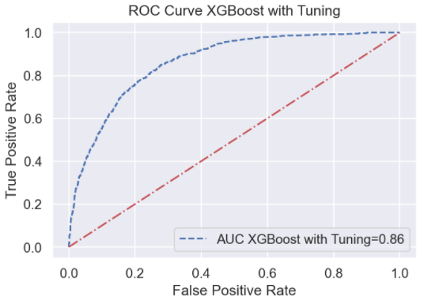

# About Project
Project yang dibuat merupakan project kolaborasi dalam kompetisi BRI Hackathon 2021.

# People Analytics
Machine Learning memungkinkan para pembuat keputusan di departemen HR untuk memprediksikan performance karyawan dalam 1 tahun kedepan menggunakan data histori KPI yang dimiliki perusahaan.
Dalam kategori People Analytics, peserta diminta untuk membangun machine learning model yang dapat memprediksi performance karyawan dengan akurat.

# Task
Menggunakan data yang ada, peserta diminta untuk memprediksikan karyawan yang akan masuk dalam golongan best performance dan yang tidak

#
# Variables Description

|Variables|Description|
|:--|:--|
|job_level| Level Jabatan Pekerja|
|job_duration_in_current_job_level | Masa Kerja pada job level saat ini|
|person_level | Level personal Pekerja|
|job_duration_in_current_person_level | Masa Kerja pada person level saat ini|
|job_duration_in_current_branch | Masa Kerja pada unit kerja saat ini|
|Employee_type | Tipe Pekerja ( 3 tipe Relationship Manager, tipe A, B , dan C)|
|gender | Jenis Kelamin|
|age | Usia|
|marital_status_maried(Y/N) | Status Pernikahan (Y / N)|
|number_of_dependences | Jumlah anak dalam tanggungan|
|Education_level | Tingkat pendidikan|
|GPA | IPK|
|year_graduated | Tahun lulus|
|job_duration_from_training | lama bekerja mulai dari training|
|branch_rotation | Jumlah rotasi pindah unit kerja|
|job_rotation | jumlah rotasi pindah jabatan|
|assign_of_otherposition | jumlah rotasi penugasan|
|annual leave | jumlah cuti tahunan|
|sick_leaves | jumlah izin sakit|
|Last_achievement_% | presentase pencapaian triwulan terakhir terhadap target|
|Achievement_above_100%\_during3quartal | Jumlah pencapaian diatas 100% dalam 3 tahun terkahir|
|Best Performance | Termasuk dalam best performance (1/0)|

# Machine Learning Model Performance
